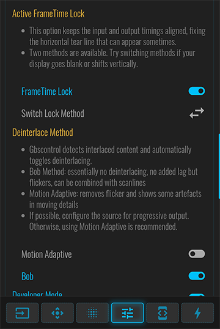
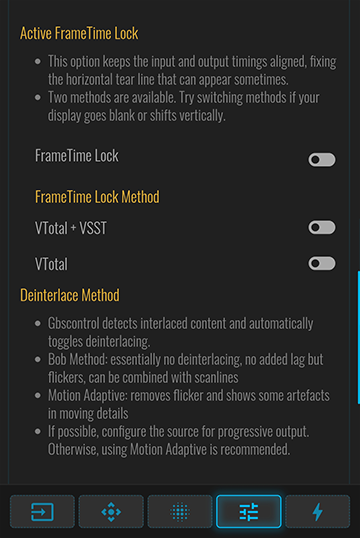
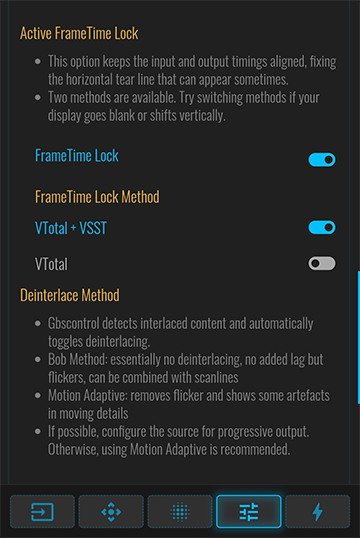
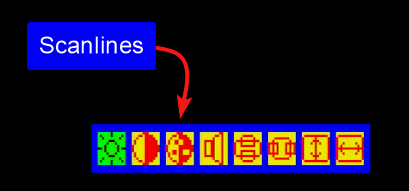

# GBS-Control-Complete 1.3.0

This repository contains a modified build of [GBS-Control](https://github.com/ramapcsx2/gbs-control) along with the required libraries for building and running it on an ESP8266 using the Arduino IDE.

Precompiled builds are available by version in the `build` directory. Below, any listed changes correspond to the respective build versions.

## Included Components

- [`gbs-control`](https://github.com/ramapcsx2/gbs-control) — Original video processor firmware, modified for ESP8266.
- [`ESPAsyncWebServer`](https://github.com/me-no-dev/ESPAsyncWebServer) — Asynchronous web server library.
- [`ESPAsyncTCP`](https://github.com/me-no-dev/ESPAsyncTCP) — Async TCP library required by the web server.
- [`esp8266-oled-ssd1306`](https://github.com/ThingPulse/esp8266-oled-ssd1306) — OLED display library for ESP8266.
- [`package_esp8266com_index.json`](http://arduino.esp8266.com/stable/package_esp8266com_index.json) — Additional Boards Manager URL for ESP8266.

## Modifications and Features Added
- [`1.4.0`] Restored [Added remove presets feature - PR #496](https://github.com/ramapcsx2/gbs-control/pull/496) which was missing because the contributor edited the generated webui.html directly instead of index.html.tpl. Changes were lost on build. Initial implementation by [AlivE-git](https://github.com/AlivE-git).
- [`1.3.0`] Restored [Added color correction settings - PR #490](https://github.com/ramapcsx2/gbs-control/pull/490) which were missing because the contributor edited the generated webui.html directly instead of index.html.tpl. Changes were lost on build. Initial implementation by [AlivE-git](https://github.com/AlivE-git).
- [`1.2.0`] Improved the Web GUI in the FrameTime Lock section by replacing the single "Switch Lock Method" cycling button with explicit toggles for each method. This change makes it immediately clear which FrameTime Lock method is active, improving usability and removing the need to consult logs.

**Before:**

The active method was hidden; switching required pressing the arrow button and observing the effect.

**After:**

Each method now has its own toggle button. The currently selected method is highlighted, allowing faster and more intuitive control.

- [`1.1.0`] Added an OSD menu option to enable scanlines and adjust strength using the same intensity levels as the Web GUI.

- [`1.0.0`] Updated include paths and `#include` directives to match current IDE/library expectations.
- [`1.0.0`] Adjusted build flags and settings for ESP8266 compatibility.
- [`1.0.0`] Patched code inconsistencies in `gbs-control` that caused compiler errors.
- [`1.0.0`] Ensured all dependencies are self-contained in this repository for reproducible builds.

You can compare these changes from the original sources by checking the [commit history](https://github.com/cpawliuk/gbs-control-complete/commits/main/).

## Planned Features
- Rework of the OLED menu system.
- Add an OSD menu option for Frametime Lock with a toggle between vtotal + VSST and vtotal only methods.
- Add an OSD menu option for Deinterlace Method with a toggle between Motion Adaptive and Bob modes.

## Credits

- [rama](https://github.com/ramapcsx2) — `gbs-control`
- [me-no-dev](https://github.com/me-no-dev) — `ESPAsyncTCP` and `ESPAsyncWebServer`
- [Daniel Eichhorn](https://github.com/squix78) & [Fabrice Weinberg](https://github.com/FWeinb) — `esp8266-oled-ssd1306`
- [Christopher Pawliuk](https://github.com/cpawliuk) — Modifications and Features Added in this package

## Versions

- [`gbs-control`] — based on commit e4e317a.
- [`ESPAsyncWebServer`] — based on commit ad3741d.
- [`ESPAsyncTCP`] — as of commit 191bdeb.
- [`esp8266-oled-ssd1306`] — as of commit f90368e.